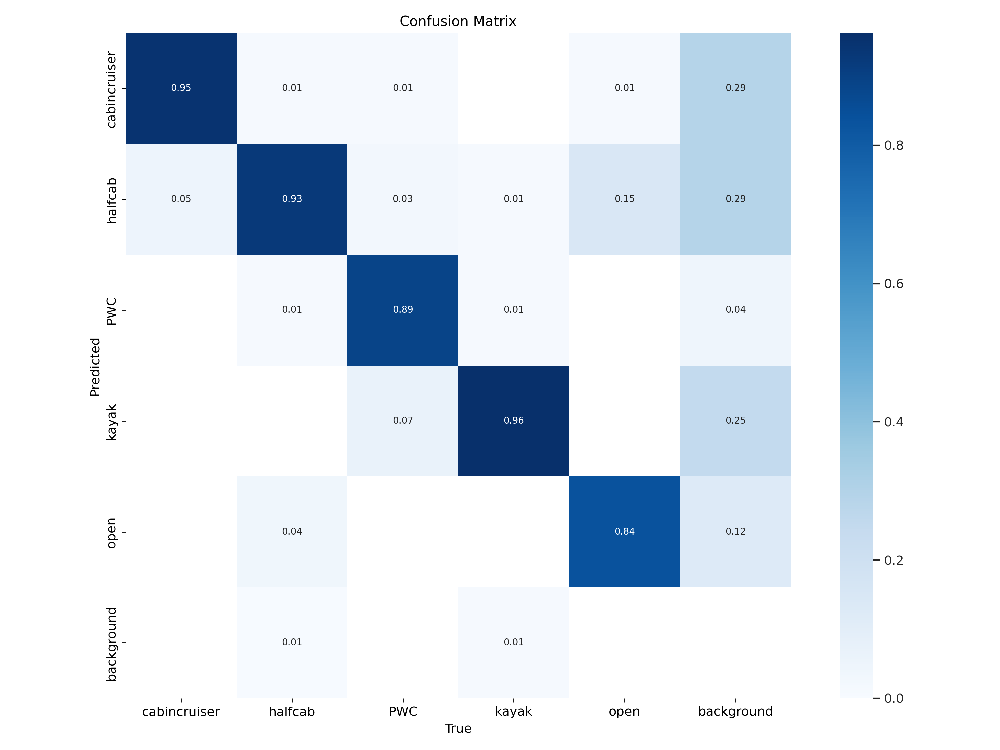

# YOLOv5 Object Detection Model

YOLOv5 is a state-of-the-art object detection model that can detect multiple objects in an image. This README file provides instructions on how to install dependencies, train the model, validate its performance, and run detections on new images using the provided code.

## Code Overview

This repository contains code for training and testing the YOLOv5 model. The main components are:

1. **Training_allImages_cbinNotOpen.ipynb**: A Jupyter notebook for installing dependencies, training the model, and running detections.
2. **datamanipulation.ipynb**: A Jupyter notebook for preparing and splitting the dataset.

## Setup

### Installing Dependencies

To get started, clone the YOLOv5 repository and install the necessary dependencies:

```bash
# Clone the yolov5 repository
!git clone https://github.com/ultralytics/yolov5

# Install dependencies
!pip install -U -r yolov5/requirements.txt

# Change to the yolov5 directory
%cd yolov5
```

### Training the Model

To train the YOLOv5 model with specified configurations and hyperparameters, run the following command:

```bash
# Train YOLOv5 model
!python train.py --img 640 --batch 32 --epochs 100 --data data.yaml --cfg models/yolov5s.yaml --weights models/yolov5s.pt --name yolo_model --nosave --cache
```

### Validating the Model

After training, validate the model to test its performance on new images:

```bash
# Validate the trained model
!python yolov5/val.py --data yolov5/data.yaml --weights last.pt
```

## Running Detections

To run detections on a new dataset, use the following code:

```python
import os
import time

for img in os.listdir(r"New_DataSet\New_DataSet"):
    os.popen(fr'python yolov5/detect.py --source "New_DataSet\New_DataSet\{img}" --weights last.pt --conf 0.1')
    time.sleep(6)
    print(img, ' Done!')
```

## Results and Performance

### Validation Performance Matrix

The validation results provide metrics such as precision, recall, and mean Average Precision (mAP) for each object class. These metrics are essential to evaluate the model's performance:

- **Precision**: Fraction of detected instances that are correct.
- **Recall**: Fraction of true instances that were detected.
- **mAP**: Mean Average Precision over different IoU thresholds.

### Confusion Matrix

The confusion matrix helps visualize the model's performance in classifying different object classes. It highlights which classes are often confused with each other.



### Precision-Recall Curve

The PR curve provides insights into the trade-off between precision and recall for different thresholds, helping to select the optimal threshold.


## Dataset Preparation

The `datamanipulation.ipynb` notebook contains code for splitting the dataset into training and validation sets. Ensure your dataset is well-labeled to improve model performance.

```python
import os
import shutil
import random

test_size = 0.2
for d in [r"data_\training", r"data_\training"]:
    for dd in os.listdir(d):
        if 'images' in dd:
            for img in os.listdir(os.path.join(d, dd)):
                random_number = random.random()
                if random_number < test_size:
                    shutil.copy(os.path.join(d, dd, img), os.path.join('data', 'validation', 'images', img))
                    shutil.copy(os.path.join(d, dd.replace('images', 'labels'), img.replace('.jpg', '.txt')), os.path.join('data', 'validation', 'labels', img.replace('.jpg', '.txt')))
                else:
                    shutil.copy(os.path.join(d, dd, img), os.path.join('data', 'training', 'images', img))
                    shutil.copy(os.path.join(d, dd.replace('images', 'labels'), img.replace('.jpg', '.txt')), os.path.join('data', 'training', 'labels', img.replace('.jpg', '.txt')))
```

## Conclusion

This README file provides a comprehensive guide to setting up, training, validating, and running detections with the YOLOv5 object detection model. For further details, refer to the code and comments in the provided Jupyter notebooks.
